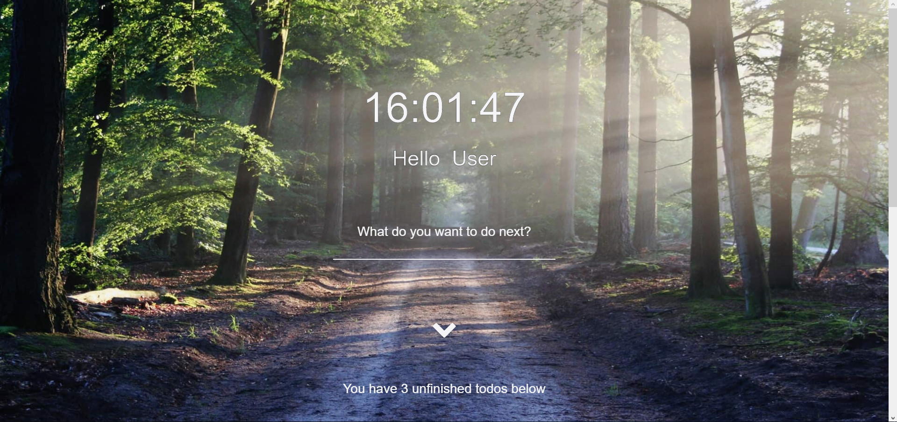
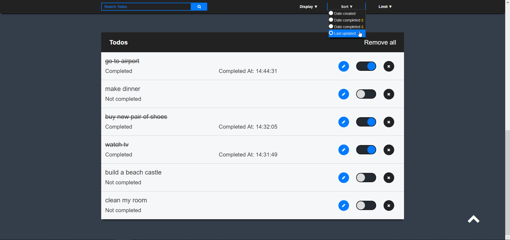
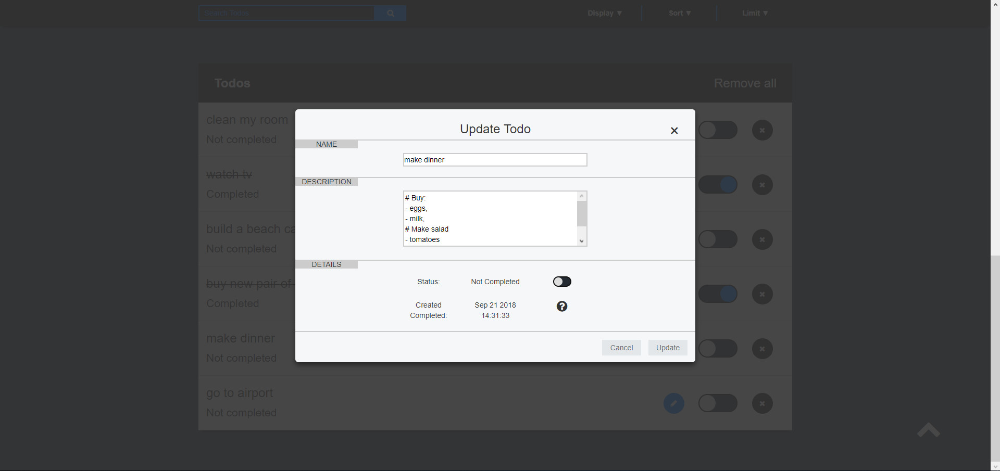

### **2DoApp**



*Info*:

Goal of this project for me was getting familiar working with mongo databases, preforming CRUD operations, JWT and authentication,
but I'm having so much fun, that I decided to go extra mile and build effective Todo application. 

Users can create new todos. They can update them, add description, tag the completed ones, delete todos and if they have too
many todos, they can always search for the ones they want, choose which one to display, sort todos and even limit the results.



*Current functionalities*:
* Posting todos to database
* Deleting todos
* Updating todos, title of todo, description and completed attribute
* Receiving todos from database and presenting them on website
* Search for todos and filter search

*Current tech stack*:
``` bash
- HTML              - Bootstrap
- CSS               - Sass
- Javascript        - EcmaScript
- Jquery            - AJAX
- NodeJS            - ExpressJS
- MongoDB           - Mongoose ORM
- BcryptJS          - Jquery Validate
- Regex             - GulpJS
``` 

*Upcoming features*:

* Proper JWT user authentication
* Improved responsive design
* Solving all known issues
* More awesome features



*Quick start*:
``` bash
# install dependencies
npm i

# run app
npm start

# Prerequisites: 
- NodeJS must be installed on your pc
- You will have to setup mongoDB database
```

Project is still in development and will be hosted on Heroku.
